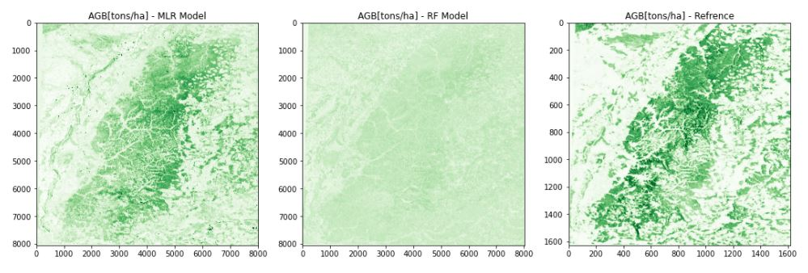

# Forest-Biomass-ML
Classical machine learning approaches for estimating forest aboveground biomass from EO data.
#Note: The reduced accuracy is attributable to GEE's Sentinel-2 cloud cover removal techniques, which introduces artifacts in the final product. 

